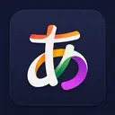

<p align="center">
  
</p>

<h1 align="center">日本の色 — NihongoColor</h1>

<p align="center">
  <a href="#features"></a>
  <a href="#"></a>
  <a href="#"></a>
  <a href="LICENSE"></a>
</p>

---

**Multi-language grammar highlighter for the browser.** Real-time morphological analysis that color-codes particles, verb forms, adjectives, and grammar structures — right on any webpage.


## ✨ What is this?

**NihongoColor** is a Chrome Extension (Manifest V3) that performs **real-time grammar highlighting** on any webpage. Instead of modifying the DOM, it uses the native [CSS Custom Highlight API](https://developer.mozilla.org/en-US/docs/Web/API/CSS_Custom_Highlight_API) for **zero-impact** rendering — fully compatible with SPAs, Google Translate, and dynamic content.

For **Japanese**, it uses [Kuromoji.js](https://github.com/takuyaa/kuromoji.js) for morphological analysis (tokenization + POS tagging). For **Korean** and **Chinese**, it uses pattern-based regex matching. New languages can be added by simply dropping a JSON file — no code changes needed.

> **Hover over any highlighted word** to see a tooltip explaining its grammatical function in your preferred language (English, Portuguese, Japanese, Korean, or Chinese).

## 🔥 Features

- **🎨 Full UI Customization:** Open the extension popup to instantly toggle grammar categories on/off or change their colors using the built-in color picker. Your preferences are saved automatically!
- **🧠 Subject-Object-Verb (SOV) Engine:** A revolutionary dual-layer parser! While grammatical particles have their text colored, their corresponding Subject, Object, and Verb clauses receive an elegant background highlight + colored border for deeper syntactical understanding.
- **🎬 Instant Subtitle Sync (Netflix & YouTube):** The engine detects when you are watching a video (YouTube, Netflix, Crunchyroll, Prime Video, etc.) and drops the internal analysis latency to 10ms. Grammars are highlighted instantly the moment a subtitle appears on screen!


## 🏗️ Architecture

```
nihongo-color/
├── languages/                 # 🗄️ Scalable language database
│   ├── registry.json          # Central index of all languages
│   ├── japanese.json          # Full pack: particles, verbs, adjectives
│   ├── korean.json            # Korean particles + regex rules
│   └── chinese.json           # Chinese grammar patterns
├── lang-loader.js             # Loads registry + packs → compiled tables
├── content.js                 # Dual-engine highlighter (Kuromoji + Regex)
├── popup.html / popup.js      # Multi-language popup UI
├── manifest.json              # Chrome Extension Manifest V3
├── lib/kuromoji.js             # Kuromoji tokenizer (bundled)
└── dict/                      # IPAdic dictionary files (~16MB)
```

### Data-Driven Design

All grammar rules, colors, and tooltips live in **JSON files** — not in code. The extension reads `registry.json` to discover languages, loads each pack, and compiles fast lookup tables at runtime.

## 🚀 Installation

### From source (Developer mode)
#### Using git
1. Clone the repository: `git clone https://github.com/YOUR_USERNAME/nihongo-color.git`
2. Open Chrome → `chrome://extensions/`
3. Enable **Developer mode** (top-right toggle)
4. Click **Load unpacked** → select the cloned folder
5. Navigate to any page with Japanese/Korean/Chinese text and click the extension icon

#### Download ZIP
URL: https://github.com/GHagui/nihongo-color
1. Click in the button `< > Code` in the repository page
2. Click in the `Download ZIP` button
3. Unzip the downloaded file
4. Open Chrome → `chrome://extensions/`
5. Enable **Developer mode** (top-right toggle)
6. Click **Load unpacked** → select the cloned folder
7. Navigate to any page with Japanese/Korean/Chinese text and click the extension icon

---

<p align="center">
  <strong>頑張ってください！ — Happy studying! 💜</strong>
</p>
